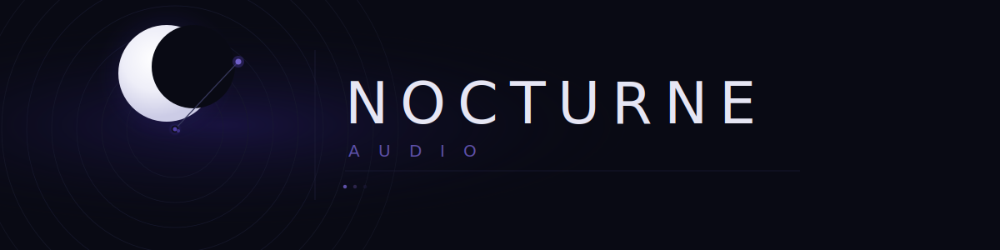

<div align="center">


### A modern, feature-rich music player for Android

[](https://github.com/jayshivram/nocturne-audio/releases)
[](#license)

</div>

---

## About

Nocturne Audio is a sleek, offline music player built with modern web technologies and compiled for Android using Capacitor. It scans your device for local music files, extracts metadata and album art, and delivers an immersive listening experience with a dark-themed UI.

## Features

**Library Management**
- Automatic music scanning with support for MP3, FLAC, M4A, WAV, OGG, Opus, AAC, WMA, and WebM
- Metadata extraction — album art, genre, year, track numbers, bitrate, sample rate
- Browse by Songs, Albums, Artists, or Folders
- Sort by title, artist, album, duration, date added, or play count
- Full-text search across your entire library

**Playback**
- Queue management — play next, add to queue
- Repeat modes — Off, Repeat All, Repeat One
- Shuffle mode
- Crossfade support (0–5 seconds)
- Gapless playback
- Sleep timer (5–90 minutes)

**10-Band Equalizer**
- Parametric EQ from 32 Hz to 16 kHz with ±12 dB gain per band
- 7 built-in presets — Flat, Bass Boost, Vocal, Classical, Rock, Jazz, Electronic
- Save your own custom presets

**Playlists & Favorites**
- Create and manage custom playlists
- Like/favorite tracks with a single tap
- Auto-generated Recently Played and Most Played lists

**UI & Experience**
- Full-screen player with blurred album art background
- Dynamic accent colors from album artwork
- Mini player for quick controls while browsing
- Time-aware greetings on the home screen
- Haptic feedback on interactions
- Native Android media notification controls (play/pause/skip from notification and lock screen)

## Tech Stack

| Layer | Technology |
|-------|-----------|
| Framework | React 19 + TypeScript |
| Build | Vite 6 |
| Styling | Tailwind CSS 4 |
| State | Zustand 5 (persisted) |
| Audio | Howler.js + Web Audio API |
| Database | Dexie (IndexedDB) |
| Native | Capacitor 8 |
| Animation | Motion (Framer Motion) |
| Icons | Lucide React |

## Getting Started

### Prerequisites

- [Node.js](https://nodejs.org/) (v18+)
- [Android Studio](https://developer.android.com/studio) (for Android builds)
- Java 17+ (JDK)

### Install dependencies

```bash
npm install
```

### Run in the browser (development)

```bash
npm run dev
```

Opens at [http://localhost:3000](http://localhost:3000).

### Build for production

```bash
npm run build
```

### Build the Android APK

```bash
npm run build
npx cap sync android
cd android
./gradlew assembleRelease    # Linux/macOS
.\gradlew.bat assembleRelease  # Windows
```

The signed APK will be at `android/app/build/outputs/apk/release/app-release.apk`.

### Run on an Android device/emulator

```bash
npx cap open android
```

This opens the project in Android Studio where you can run it directly on a connected device or emulator.

## Project Structure

```
src/
├── App.tsx                  # Root component with navigation
├── components/
│   ├── HomeScreen.tsx       # Home with greeting & quick actions
│   ├── LibraryScreen.tsx    # Songs, Albums, Artists, Folders
│   ├── SearchScreen.tsx     # Full-text search
│   ├── PlaylistsScreen.tsx  # Playlist management
│   ├── EqualizerScreen.tsx  # 10-band EQ with presets
│   ├── SettingsScreen.tsx   # App settings & library stats
│   ├── FullPlayer.tsx       # Immersive full-screen player
│   ├── MiniPlayer.tsx       # Compact player overlay
│   └── BottomNav.tsx        # Navigation bar
├── services/
│   ├── audioEngine.ts       # Howler.js + Web Audio API playback
│   ├── fileScanner.ts       # Device file scanning & metadata
│   ├── mediaControls.ts     # Android notification controls
│   ├── playlistManager.ts   # Playlist CRUD operations
│   └── capacitorBridge.ts   # Native bridge utilities
├── store/
│   └── useMusicStore.ts     # Zustand store (library, playback, UI)
├── db/
│   └── musicDatabase.ts     # Dexie IndexedDB schema
└── types.ts                 # TypeScript interfaces
android/                     # Capacitor Android project
```

## Download

Grab the latest APK from the [Releases](https://github.com/jayshivram/nocturne-audio/releases) page.

> **Note:** You may need to enable *Install from unknown sources* in your Android settings.

## License

MIT

## Disclaimer

THIS SOFTWARE IS PROVIDED "AS IS", WITHOUT WARRANTY OF ANY KIND, EXPRESS OR IMPLIED, INCLUDING BUT NOT LIMITED TO THE WARRANTIES OF MERCHANTABILITY, FITNESS FOR A PARTICULAR PURPOSE AND NONINFRINGEMENT. IN NO EVENT SHALL THE AUTHORS OR COPYRIGHT HOLDERS BE LIABLE FOR ANY CLAIM, DAMAGES OR OTHER LIABILITY, WHETHER IN AN ACTION OF CONTRACT, TORT OR OTHERWISE, ARISING FROM, OUT OF OR IN CONNECTION WITH THE SOFTWARE OR THE USE OR OTHER DEALINGS IN THE SOFTWARE.

- **No Liability** — The developer assumes no responsibility for any damage, data loss, or issues arising from the use or misuse of this application.
- **No Warranty** — This software is provided without any guarantees of functionality, reliability, or fitness for any particular purpose.
- **User Responsibility** — Users are solely responsible for how they use this application, including compliance with all applicable local, state, and international laws.
- **Third-Party Content** — This app plays locally stored audio files. The developer does not host, distribute, or endorse any copyrighted content. Users are responsible for ensuring they have the legal right to play any audio files on their device.
- **Third-Party Dependencies** — This project uses open-source libraries and plugins. The developer is not responsible for vulnerabilities, bugs, or issues originating from third-party dependencies.
- **Privacy** — This app operates entirely offline and does not collect, transmit, or store any personal data on external servers. All data remains on the user's device.
